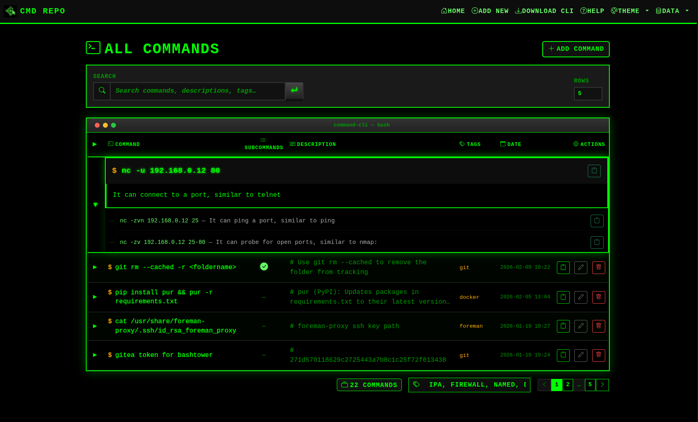

# Command-CLI

[](https://hub.docker.com/r/ftsiadimos/command-cli-image)
[](LICENSE)
[](https://python.org)

> A lightweight Flask application for storing, searching, and managing your shell commands with both a web UI and CLI client.



---

## ✨ Features

- 🌐 **Web Interface** — Clean Bootstrap 5 UI with search, pagination, and mobile support
- 💻 **CLI Client** — Pure Bash client for terminal workflows (`repocomcli`)
- 🔍 **Search** — Full-text search across commands, descriptions, and tags
- 📋 **Copy to Clipboard** — One-click copy from web or CLI
- 📤 **Export/Import** — Backup and restore your commands as JSON
- 🐳 **Docker Ready** — Easy deployment with persistent storage
- 🏷️ **Tagging** — Organize commands with comma-separated tags

---

## 🚀 Quick Start

### Option 1: Docker (Recommended)

```bash
# Pull and run with persistent storage
docker run -d \
  --name command-cli \
  --restart unless-stopped \
  -p 5001:5001 \
  -v command-cli-data:/app/instance \
  ftsiadimos/command-cli-image:latest
```

Open http://localhost:5001 in your browser.

### Option 2: Manual Installation

```bash
# Clone the repository
git clone https://github.com/ftsiadimos/command-cli-repo
cd command-cli-repo

# Create virtual environment
python3 -m venv .venv
source .venv/bin/activate

# Install dependencies
pip install -r requirements.txt

# Run the application
python app.py
```

Open http://127.0.0.1:5000 in your browser.

---

## 🖥️ CLI Client (`repocomcli`)

A pure Bash CLI client for managing commands from the terminal.

### Installation

```bash
# Copy to your PATH
sudo cp repocomcli /usr/local/bin/
sudo chmod +x /usr/local/bin/repocomcli

# Configure the server (if not localhost)
repocomcli config set 192.168.1.100 --port 5001
```

### Requirements

- **curl** (required)
- **jq** (recommended for better output)
- **xclip** or **xsel** (optional, for clipboard support)

### Usage

```bash
# Add a new command
repocomcli add "docker ps -a" -d "List all containers" -t "docker"

# List all commands
repocomcli list

# Search commands
repocomcli list -s docker

# Show specific command details
repocomcli show 5

# Copy command to clipboard
repocomcli copy 5

# Export all commands to JSON
repocomcli export backup.json

# Import commands from JSON
repocomcli import backup.json

# View/change configuration
repocomcli config get
repocomcli config set myserver.local --port 5001
```

### CLI Reference

| Command | Description |
|---------|-------------|
| `add <cmd> [-d desc] [-t tags]` | Add a new command |
| `list [-s search] [-n limit]` | List commands with optional search/limit |
| `show <id>` | Display full details of a command |
| `copy <id>` | Copy command to clipboard |
| `export <file.json>` | Export all commands to JSON file |
| `import <file.json>` | Import commands from JSON file |
| `config get` | Show current configuration |
| `config set <host> [--port N]` | Configure API server |
| `--help` | Show help message |
| `--version` | Show version |

---

## 🔌 API Reference

### Endpoints

| Method | Endpoint | Description |
|--------|----------|-------------|
| `GET` | `/api/commands` | List all commands |
| `GET` | `/api/commands?search=<query>` | Search commands |
| `POST` | `/api/commands` | Add a new command |
| `GET` | `/export-json` | Export all commands as JSON |
| `POST` | `/import-json` | Import commands from JSON |

### Examples

**Add a command:**

```bash
curl -X POST http://localhost:5000/api/commands \
  -H "Content-Type: application/json" \
  -d '{
    "command": "find . -name \"*.log\" -mtime +7 -delete",
    "description": "Delete log files older than 7 days",
    "tags": "cleanup,logs,find"
  }'
```

**Search commands:**

```bash
curl "http://localhost:5000/api/commands?search=docker"
```

**Export all commands:**

```bash
curl http://localhost:5000/export-json -o backup.json
```

---

## 🐳 Docker Compose

```yaml
version: '3.8'

services:
  command-cli:
    image: ftsiadimos/command-cli-image:latest
    container_name: command-cli
    restart: unless-stopped
    ports:
      - "5001:5001"
    volumes:
      - command-cli-data:/app/instance

volumes:
  command-cli-data:
```

---

## 📁 Project Structure

```
command-cli/
├── app.py              # Flask application
├── config.py           # Configuration settings
├── models.py           # SQLAlchemy models
├── forms.py            # WTForms definitions
├── repocomcli          # Bash CLI client
├── requirements.txt    # Python dependencies
├── Dockerfile          # Docker build file
├── docker-compose.yml  # Docker Compose config
├── instance/
│   └── app.db          # SQLite database
├── templates/          # Jinja2 templates
│   ├── layout.html
│   ├── index.html
│   ├── add.html
│   ├── edit.html
│   ├── help.html
│   └── import.html
└── static/
    └── js/             # JavaScript files
```

---

## 🛠️ Configuration

### Environment Variables

| Variable | Default | Description |
|----------|---------|-------------|
| `FLASK_ENV` | `production` | Flask environment |
| `SECRET_KEY` | (random) | Session secret key |

### CLI Configuration

The CLI stores its configuration in `~/.config/command-cli/config.json`:

```json
{
  "api_base": "192.168.1.100",
  "port": 5001
}
```

---

## 📝 License

This project is licensed under the MIT License.

---

## 👤 Author

**Fotios Tsiadimos**

- GitHub: [@ftsiadimos](https://github.com/ftsiadimos)

---

## 🤝 Contributing

Contributions, issues, and feature requests are welcome!
